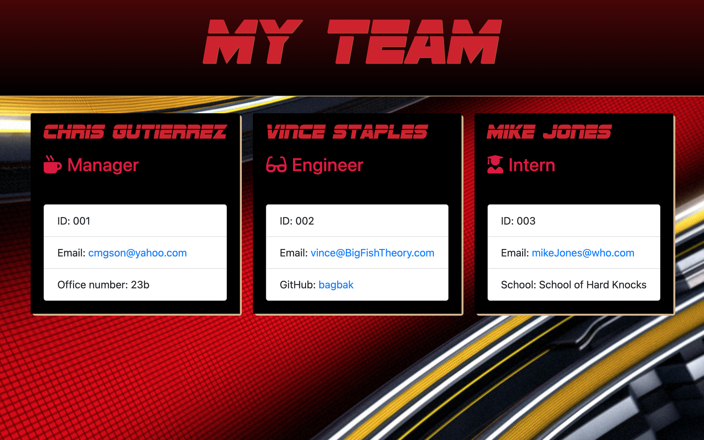

[](https://opensource.org/licenses/MIT)
   


# <div align='center'> **Team Generator** </div>

--- 

--- 

## **Table Of Contents** 

---

1. [Description](#description)
2. [Installation](#installation)
3. [Usage](#usage)
4. [Contributing](#contributing)
5. [Tests](#tests)
6. [Review and Contribute](#github)
--- 


## <div align ='center'> <a name="description"></a> **Description** </div> 

--- 

Input Pertinent information for every team member required through a CLI to produce a Team Page for viewing.

--- 
 
## <div align ='center'> <a name="installation"></a> **Installation** </div>
--- 
 
<ol><li>open command line and run npm i, in order to download dependencies.</li>

```
npm i
```
<li>run the app.js with node in order to launch app.  or just hit npm run.  There is a script set up in the package.json that should handle this if the filepath is correct.</li>

```
node app.js
```
</ol>

--- 

## <div align ='center'> <a name="usage"></a> **Usage** </div>

--- 

<ol>
    <li>answer required questions for each employee in order to build the team page</li>
    <li>once complete open the team.html file and it will be styled and written ready for deployment</li>
</ol>

--- 

## <div align ='center'> <a name="contributing"></a> **Contributing** </div>

--- 

simply fork the repository and clone it, licence information is in the readme.

--- 

## <div align ='center'> <a name="tests"></a> **Tests and Screenshots** </div>


--- 

The tests folder that is included test the constructors for each of the divisions of employees.

[This is a short video demonstration of app](https://drive.google.com/file/d/1JzC0_iPIsdxmfvgiWeomAJM-YDfydAxK/view?usp=sharing)

[demo of npm test phase completion](https://drive.google.com/file/d/1YTYvxeI8wCmpg9DzEogIzBi36I2uCc0n/view)

### <div align ='center'> Shot of page created from CLI </div>


--- 

## <div align ='center'> <a name="github"></a> **Github and Email** </div>

--- 

## <div align ='center'> **Review and contribute here**</div>

### _Github:_ [cmgson](https://github.com/cmgson)


### _Email:_ cmgson1@gmail.com

--- 
